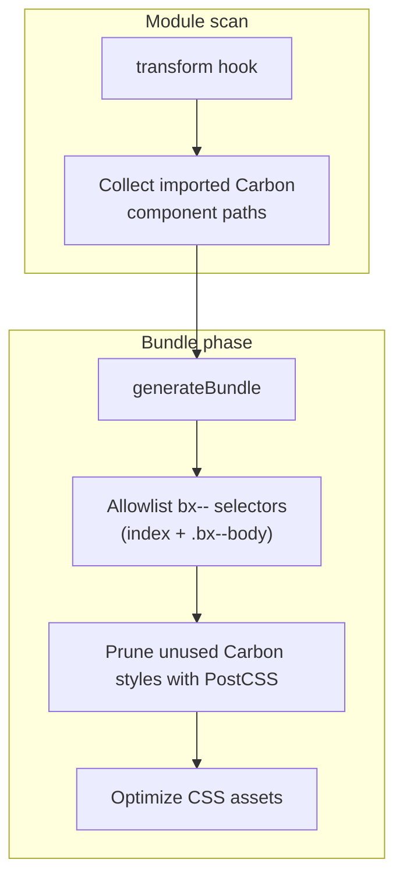

# carbon-preprocess-svelte

[![NPM][npm]][npm-url]


> A zero-dependency library providing Svelte preprocessors and build plugins for the [Carbon Design System](https://carbondesignsystem.com/).

## Installation

Install `carbon-preprocess-svelte` as a development dependency.

```sh
# npm
npm i -D carbon-preprocess-svelte

# pnpm
pnpm i -D carbon-preprocess-svelte

# Yarn
yarn add -D carbon-preprocess-svelte

# Bun
bun add -D carbon-preprocess-svelte
```

## Usage

- [**optimizeImports**](#optimizeimports): Svelte preprocessor that rewrites Carbon Svelte imports to their source path in the `script` block, making development compile times dramatically faster.
- [**optimizeCss**](#optimizecss): Vite/Rollup plugin that removes unused Carbon styles, resulting in smaller CSS bundles.
- [**OptimizeCssPlugin**](#optimizecssplugin): The corresponding `optimizeCss` plugin for Webpack that removes unused Carbon styles.

### `optimizeImports`

`optimizeImports` is a Svelte preprocessor that rewrites barrel imports from Carbon components/icons/pictograms packages to their source Svelte code paths. This can significantly speed up development and build compile times while preserving typeahead and autocompletion offered by integrated development environments (IDE) like VS Code.

The preprocessor optimizes imports from the following packages:

- [carbon-components-svelte](https://github.com/carbon-design-system/carbon-components-svelte)
- [carbon-icons-svelte](https://github.com/carbon-design-system/carbon-icons-svelte)
- [carbon-pictograms-svelte](https://github.com/carbon-design-system/carbon-pictograms-svelte)

```diff
- import { Button } from "carbon-components-svelte";
+ import Button from "carbon-components-svelte/src/Button/Button.svelte";

- import { Add } from "carbon-icons-svelte";
+ import Add from "carbon-icons-svelte/lib/Add.svelte";

- import { Airplane } from "carbon-pictograms-svelte";
+ import Airplane from "carbon-pictograms-svelte/lib/Airplane.svelte";
```

> [!NOTE]
> When this preprocessor was first created, there was no workaround to optimize slow cold start times with Vite in development.
> Today, [@sveltejs/vite-plugin-svelte](https://github.com/sveltejs/vite-plugin-svelte) enables [`prebundleSvelteLibraries: true`](https://github.com/sveltejs/vite-plugin-svelte/blob/ba4ac32cf5c3e9c048d1ac430c1091ca08eaa130/docs/config.md#prebundlesveltelibraries) by default.
> However, this preprocessor is still useful for non-Vite bundlers, like Rollup and Webpack. Also, it can further improve cold start development times even with `prebundleSvelteLibraries: true`.

`optimizeImports({ experimental: { liveIndex: true } })` builds its component index from your installed `carbon-components-svelte` instead of the version bundled with this package — see [`experimental.liveIndex`](#optimizecss-api) under `optimizeCss` for details; the behavior is identical here.

#### SvelteKit

See [examples/sveltekit](examples/sveltekit).

```js
// svelte.config.js
import adapter from "@sveltejs/adapter-static";
import { vitePreprocess } from "@sveltejs/vite-plugin-svelte";
import { optimizeImports } from "carbon-preprocess-svelte";

/** @type {import('@sveltejs/kit').Config} */
const config = {
  preprocess: [
    // Preprocessors are run in sequence.
    // If using TypeScript, the code must be transpiled first.
    vitePreprocess(),
    optimizeImports(),
  ],
  kit: {
    adapter: adapter(),
  },
};

export default config;
```

#### Vite

See [examples/vite](examples/vite).

```js
// vite.config.js
import { svelte } from "@sveltejs/vite-plugin-svelte";
import { vitePreprocess } from "@sveltejs/vite-plugin-svelte";
import { optimizeImports } from "carbon-preprocess-svelte";

/** @type {import('vite').UserConfig} */
export default {
  plugins: [
    svelte({
      preprocess: [
        // Preprocessors are run in sequence.
        // If using TypeScript, the code must be transpiled first.
        vitePreprocess(),
        optimizeImports(),
      ],
    }),
  ],
};
```

#### Rollup

This code is abridged; see [examples/rollup](examples/rollup) for a full set-up.

```js
// rollup.config.js
import svelte from "rollup-plugin-svelte";
import { optimizeImports } from "carbon-preprocess-svelte";

export default {
  plugins: [
    svelte({
      preprocess: [optimizeImports()],
    }),
  ],
};
```

#### Webpack

This code is abridged; see [examples/webpack](examples/webpack) for a full set-up.

```js
// webpack.config.mjs
import { optimizeImports } from "carbon-preprocess-svelte";

export default {
  module: {
    rules: [
      {
        test: /\.svelte$/,
        use: {
          loader: "svelte-loader",
          options: {
            hotReload: !PROD,
            preprocess: [optimizeImports()],
            compilerOptions: { dev: !PROD },
          },
        },
      },
    ],
  },
};
```

### `optimizeCss`

`optimizeCss` is a Vite plugin that removes unused Carbon styles at build time. The plugin is compatible with Rollup ([Vite](https://vitejs.dev/guide/api-plugin) extends the Rollup plugin API).

<details>
<summary>How it works</summary>

The plugin uses `apply: "build"` and `enforce: "post"`, so it runs only on production builds and after other plugins.

1. During `transform`, it collects absolute paths of imported `carbon-components-svelte` sources.
2. During `generateBundle`, for each emitted CSS file it builds an allowlist of every `bx--` class tied to those components via an internal index, plus global selectors like `.bx--body`.
3. A PostCSS plugin removes rules whose selectors are only Carbon (`bx--`) classes outside that allowlist. BEM-style variants are kept when they match a needed base class; selectors without that prefix are left unchanged.
4. Empty rules are discarded, and the CSS bundles are optimized.



</details>

```diff
$ vite build

Optimized index-CU4gbKFa.css
- Before: 606.26 kB
+ After:   53.22 kB (-91.22%)

dist/index.html                  0.34 kB │ gzip:  0.24 kB
dist/assets/index-CU4gbKFa.css  53.22 kB │ gzip:  6.91 kB
dist/assets/index-Ceijs3eO.js   53.65 kB │ gzip: 15.88 kB
```

> [!NOTE]
> This is a plugin and not a Svelte preprocessor. It should be added to the list of `vite.plugins`. For Vite set-ups, this plugin _is not run_ during development and is only executed when building the app (i.e., `vite build`). For Rollup and Webpack, you should conditionally apply the plugin to only execute when building for production.

#### SvelteKit

See [examples/sveltekit](examples/sveltekit).

```js
// vite.config.js
import { sveltekit } from "@sveltejs/kit/vite";
import { optimizeCss } from "carbon-preprocess-svelte";
import { defineConfig } from "vite";

export default defineConfig({
  plugins: [sveltekit(), optimizeCss()],
});
```

#### Vite

See [examples/vite](examples/vite).

```js
// vite.config.js
import { svelte } from "@sveltejs/vite-plugin-svelte";
import { optimizeCss } from "carbon-preprocess-svelte";

/** @type {import('vite').UserConfig} */
export default {
  plugins: [svelte(), optimizeCss()],
};
```

#### Rollup

This code is abridged; see [examples/rollup](examples/rollup) for a full set-up.

```js
// rollup.config.js
import svelte from "rollup-plugin-svelte";
import { optimizeCss } from "carbon-preprocess-svelte";

const production = !process.env.ROLLUP_WATCH;

export default {
  plugins: [
    svelte({
      preprocess: [optimizeImports()],
    }),

    // Only apply the plugin when building for production.
    production && optimizeCss(),
  ],
};
```

#### `optimizeCss` API

```ts
optimizeCss({
  /**
   * Set to `true` to suppress the size difference
   * logging between original and optimized CSS.
   * @default false
   */
  silent: true,

  /**
   * By default, pre-compiled Carbon StyleSheets ship `@font-face` rules
   * for all available IBM Plex fonts, many of which are not actually
   * used in Carbon Svelte components.
   *
   * The default behavior is to preserve the following IBM Plex fonts:
   * - IBM Plex Sans (300/400/600-weight and normal-font-style rules)
   * - IBM Plex Mono (400-weight and normal-font-style rules)
   *
   * Set to `true` to disable this behavior and
   * retain *all* IBM Plex `@font-face` rules.
   * @default false
   */
  preserveAllIBMFonts: true,

  /**
   * Class selectors to always keep, regardless of which components are
   * imported. Use for Carbon classes the allowlist misses: hand-written
   * classes in app markup (e.g. `<div class="bx--grid">`) and theme/layout
   * utilities that no component file references.
   *
   * Each entry is either:
   * - a `string`, matched literally as a complete class token. `.bx--grid`
   *   keeps `.bx--grid` and `.bx--grid:hover`, but not `.bx--grid--wide`
   * - a `RegExp`, tested against the whole selector. `/^\.bx--btn--/` keeps
   *   every `.bx--btn--*` variant
   *
   * @default []
   */
  safelist: [".bx--grid", ".bx--aspect-ratio", /^\.bx--btn--/],

  /**
   * Glob patterns (relative to the working directory) of source files to scan
   * for literal `bx--`-prefixed tokens. Every token found is kept. Use when
   * class names are built at runtime. See the warning below.
   *
   * @default undefined
   */
  content: ["src/**/*.{svelte,js,ts}"],

  /**
   * Experimental. Enables stricter CSS tree-shaking that can drastically
   * reduce output size compared to the default baseline, depending on which
   * Carbon components you import. Small bundles that only use a handful of
   * components tend to see the largest gains.
   *
   * Compared to the default matcher, `strict`:
   * - Prunes individual selectors from comma-separated lists instead of
   *   keeping the entire rule when any selector matches
   * - Requires every Carbon class in a compound selector to match when only
   *   shared modifiers (e.g. `.bx--skeleton`) hit, so importing Button no
   *   longer pulls in Tabs skeleton styles
   * - Drops flatpickr and legacy single-hyphen `bx-` rules unless DatePicker
   *   (or similar) is in the bundle
   * - Uses parenthesis-aware selector parsing for `:is()` and similar
   *
   * @default false
   */
  experimental: {
    strict: true,

    /**
     * Experimental. Builds the component index from *this project's*
     * installed `carbon-components-svelte` instead of the version bundled
     * with `carbon-preprocess-svelte`. Useful when your app is ahead of (or
     * behind) the Carbon version this package was last released against —
     * new/renamed components and classes are picked up without waiting on a
     * `carbon-preprocess-svelte` release.
     *
     * Resolved once per build and cached on disk at
     * `node_modules/.cache/carbon-preprocess-svelte/<carbon-version>.json`,
     * so a Carbon bump invalidates the cache automatically. Falls back to
     * the bundled static index if the live build fails for any reason
     * (unresolvable `carbon-components-svelte`, unexpected `src` layout,
     * etc.), so enabling it can't turn a working build into a broken one.
     *
     * `optimizeImports` accepts the same option, independently, since it
     * doesn't share a config object with `optimizeCss`.
     *
     * @default false
     */
    liveIndex: true,
  },
});
```

> [!WARNING]
> **Dynamically constructed class names are not detected.** The allowlist comes from Carbon component source files you import. It only knows about classes those components reference. Runtime assembly is invisible:
>
> ```svelte
> <!-- pruned: optimizer never sees literal `bx--btn--secondary` -->
> <button class={`bx--btn--${kind}`}>...</button>
> ```
>
> Hand-written Carbon classes in your markup (e.g. `<div class="bx--grid">`) have the same problem. No imported component references them, so they get pruned. If the plugin "deleted your styles," this is usually why.
>
> Two ways to fix it:
>
> - **`safelist`**: list selectors (or a `RegExp`) to keep: `safelist: [".bx--grid", /^\.bx--btn--/]`.
> - **`content`**: scan your source for literal `bx--` prefixes: `content: ["src/**/*.{svelte,js,ts}"]`.

### `OptimizeCssPlugin`

For Webpack users, `OptimizeCssPlugin` is a drop-in replacement for `optimizeCss`. The plugin API is identical to that of `optimizeCss`. Similarly, the plugin only runs in production mode.

This code is abridged; see [examples/webpack](examples/webpack) or [examples/webpack@svelte-5](examples/webpack@svelte-5) for a full set-up.

```js
// webpack.config.mjs
import { OptimizeCssPlugin } from "carbon-preprocess-svelte";

export default {
  plugins: [new OptimizeCssPlugin()],
};
```

## Examples

Refer to [examples](examples) for common set-ups.

## Contributing

Refer to the [contributing guidelines](CONTRIBUTING.md).

## License

[Apache 2.0](LICENSE)

[npm]: https://img.shields.io/npm/v/carbon-preprocess-svelte.svg?color=262626&style=for-the-badge
[npm-url]: https://npmjs.com/package/carbon-preprocess-svelte
