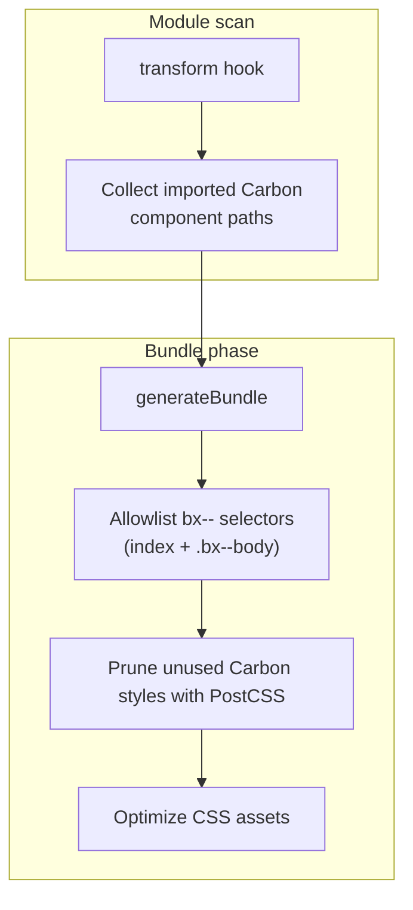

# carbon-preprocess-svelte

[![NPM][npm]][npm-url]


> Zero-dependency Svelte preprocessors and build plugins for the [Carbon Design System](https://carbondesignsystem.com/).

## Installation

Install `carbon-preprocess-svelte` as a development dependency.

```sh
# npm
npm i -D carbon-preprocess-svelte

# pnpm
pnpm i -D carbon-preprocess-svelte

# Yarn
yarn add -D carbon-preprocess-svelte

# Bun
bun add -D carbon-preprocess-svelte
```

## Usage

This package has five independent tools; pick the one matching your bundler or pipeline.

| Tool | Type | Works with | Description |
| :--- | :--- | :--- | :--- |
| [`optimizeImports`](#optimizeimports) | Svelte preprocessor | Any bundler | Rewrites Carbon imports straight to source, for faster dev and build times |
| [`optimizeCss`](#optimizecss) | Build plugin | Vite, Rollup, Rolldown | Prunes unused Carbon styles at build time, shrinking CSS bundles up to 90% |
| [`OptimizeCssPlugin`](#optimizecssplugin) | Build plugin | Webpack, Rspack | `optimizeCss` for Webpack and Rspack |
| [`optimizeCarbonCss`](#optimizecarboncss) | Async function | esbuild, Bun.build, any post-build script | Programmatic version of the same CSS optimization engine, for any pipeline |
| [CLI](#cli) | Command-line tool | esbuild, Bun, any pipeline without a plugin hook | Prunes unused Carbon styles from built CSS files with a single command |

### `optimizeImports`

`optimizeImports` rewrites barrel imports from Carbon's components/icons/pictograms packages to their source Svelte paths, speeding up dev and build compile times while preserving IDE typeahead and autocomplete.

The preprocessor optimizes imports from the following packages:

- [carbon-components-svelte](https://github.com/carbon-design-system/carbon-components-svelte)
- [carbon-icons-svelte](https://github.com/carbon-design-system/carbon-icons-svelte)
- [carbon-pictograms-svelte](https://github.com/carbon-design-system/carbon-pictograms-svelte)

```diff
- import { Button } from "carbon-components-svelte";
+ import Button from "carbon-components-svelte/src/Button/Button.svelte";

- import { Add } from "carbon-icons-svelte";
+ import Add from "carbon-icons-svelte/lib/Add.svelte";

- import { Airplane } from "carbon-pictograms-svelte";
+ import Airplane from "carbon-pictograms-svelte/lib/Airplane.svelte";
```

> [!NOTE]
> This preprocessor predates [@sveltejs/vite-plugin-svelte](https://github.com/sveltejs/vite-plugin-svelte)'s [`prebundleSvelteLibraries: true`](https://github.com/sveltejs/vite-plugin-svelte/blob/ba4ac32cf5c3e9c048d1ac430c1091ca08eaa130/docs/config.md#prebundlesveltelibraries), now the default, which covers the same Vite cold-start problem. It's still useful for non-Vite bundlers like Rollup and Webpack, and can further improve cold start even with `prebundleSvelteLibraries: true`.

`optimizeImports({ experimental: { liveIndex: true } })` builds its index from your installed `carbon-components-svelte` instead of the bundled version. See [`experimental.liveIndex`](#optimizecss-api) under `optimizeCss` for details; behavior is identical here.

**Set-ups:** [SvelteKit](#sveltekit) · [Vite](#vite) · [Rollup](#rollup) · [Webpack](#webpack) · [Rspack](#rspack)

#### SvelteKit

See [examples/sveltekit](examples/sveltekit).

```js
// svelte.config.js
import adapter from "@sveltejs/adapter-static";
import { vitePreprocess } from "@sveltejs/vite-plugin-svelte";
import { optimizeImports } from "carbon-preprocess-svelte";

/** @type {import('@sveltejs/kit').Config} */
const config = {
  preprocess: [
    // Preprocessors are run in sequence.
    // If using TypeScript, the code must be transpiled first.
    vitePreprocess(),
    optimizeImports(),
  ],
  kit: {
    adapter: adapter(),
  },
};

export default config;
```

#### Vite

See [examples/vite](examples/vite).

```js
// vite.config.js
import { svelte } from "@sveltejs/vite-plugin-svelte";
import { vitePreprocess } from "@sveltejs/vite-plugin-svelte";
import { optimizeImports } from "carbon-preprocess-svelte";

/** @type {import('vite').UserConfig} */
export default {
  plugins: [
    svelte({
      preprocess: [
        // Preprocessors are run in sequence.
        // If using TypeScript, the code must be transpiled first.
        vitePreprocess(),
        optimizeImports(),
      ],
    }),
  ],
};
```

#### Rollup

This code is abridged; see [examples/rollup](examples/rollup) for a full set-up.

```js
// rollup.config.js
import svelte from "rollup-plugin-svelte";
import { optimizeImports } from "carbon-preprocess-svelte";

export default {
  plugins: [
    svelte({
      preprocess: [optimizeImports()],
    }),
  ],
};
```

#### Webpack

This code is abridged; see [examples/webpack](examples/webpack) for a full set-up.

```js
// webpack.config.mjs
import { optimizeImports } from "carbon-preprocess-svelte";

export default {
  module: {
    rules: [
      {
        test: /\.svelte$/,
        use: {
          loader: "svelte-loader",
          options: {
            hotReload: !PROD,
            preprocess: [optimizeImports()],
            compilerOptions: { dev: !PROD },
          },
        },
      },
    ],
  },
};
```

#### Rspack

[Rspack](https://rspack.rs) implements webpack's plugin and loader APIs, so setup matches [Webpack](#webpack) above unchanged. This code is abridged; see [examples/rspack](examples/rspack) for a full set-up.

```js
// rspack.config.mjs
import { optimizeImports } from "carbon-preprocess-svelte";

export default {
  module: {
    rules: [
      {
        test: /\.svelte$/,
        use: {
          loader: "svelte-loader",
          options: {
            hotReload: !PROD,
            preprocess: [optimizeImports()],
            compilerOptions: { dev: !PROD },
          },
        },
      },
    ],
  },
};
```

### `optimizeCss`

`optimizeCss` is a Vite plugin that strips unused Carbon styles at build time. It also works with Rollup and [Rolldown](https://rolldown.rs), which share the same plugin API ([Vite](https://vitejs.dev/guide/api-plugin) extends Rollup's).

<details>
<summary>How it works</summary>

The plugin uses `apply: "build"` and `enforce: "post"`, so it runs only on production builds and after other plugins.

1. During `transform`, it collects imported `carbon-components-svelte` source paths, plus (unless `scanModules: false`) every literal `bx--` token found in other modules.
2. During `generateBundle`, for each emitted CSS file it builds an allowlist of every `bx--` class tied to those components via an internal index, plus global selectors like `.bx--body`.
3. A PostCSS plugin prunes Carbon (`bx--`) selectors outside that allowlist:
   - Individual selectors are pruned from comma-separated lists, not the whole rule, when only one branch matches
   - Every Carbon class in a compound selector (same-element and descendant) must match the allowlist, so importing NumberInput doesn't pull in `.bx--modal .bx--number` context rules, and Button doesn't pull in Tabs skeleton styles via a shared `.bx--skeleton` modifier
   - Flatpickr and legacy single-hyphen `bx-` rules are dropped unless DatePicker (or another flatpickr-based component) is in the bundle
   - Selectors are parsed with parenthesis-awareness, handling `:is(...)` and `:not(...)` groups instead of naively splitting on commas
4. Empty rules are discarded, and the CSS bundles are optimized.

**Risk profile:** validated against a fixture suite covering most Carbon components and common multi-component bundles ([`tests/fixtures/optimize-css`](tests/fixtures/optimize-css)) with zero unexplained survivors, but it shares the blind spot in the warning below: class names that never appear as a literal `bx--` token in bundled code.


```mermaid
flowchart TB
  subgraph scan["Module scan"]
    T[transform hook] --> S["Collect imported Carbon<br/>component paths"]
  end
  subgraph emit["Bundle phase"]
    S --> G[generateBundle]
    G --> A["Allowlist bx-- selectors<br/>(index + .bx--body)"]
    A --> P[Prune unused Carbon styles with PostCSS]
    P --> R[Optimize CSS assets]
  end

  class T,G hook
  class S,A data
  class P,R css
```

</details>

```diff
$ vite build

Optimized index-CU4gbKFa.css
- Before: 606.26 kB
+ After:   53.22 kB (-91.22%)

dist/index.html                  0.34 kB │ gzip:  0.24 kB
dist/assets/index-CU4gbKFa.css  53.22 kB │ gzip:  6.91 kB
dist/assets/index-Ceijs3eO.js   53.65 kB │ gzip: 15.88 kB
```

> [!NOTE]
> This is a plugin, not a Svelte preprocessor. Add it to `vite.plugins`. Under Vite it only runs on `vite build`, never during dev. Under Rollup and Webpack, apply it conditionally so it only runs for production builds.

**Set-ups:** [SvelteKit](#sveltekit-1) · [Astro](#astro) · [Vite](#vite-1) · [Rollup](#rollup-1) · [Rolldown](#rolldown) · [API reference](#optimizecss-api)

#### SvelteKit

See [examples/sveltekit](examples/sveltekit).

```js
// vite.config.js
import { sveltekit } from "@sveltejs/kit/vite";
import { optimizeCss } from "carbon-preprocess-svelte";
import { defineConfig } from "vite";

export default defineConfig({
  plugins: [sveltekit(), optimizeCss()],
});
```

#### Astro

See [examples/astro](examples/astro).

```js
// astro.config.mjs
import svelte from "@astrojs/svelte";
import { optimizeCss } from "carbon-preprocess-svelte";
import { defineConfig } from "astro/config";

export default defineConfig({
  integrations: [svelte()],
  build: {
    // Keep CSS as a separate asset so the pruned output is visible.
    inlineStylesheets: "never",
  },
  vite: {
    plugins: [optimizeCss()],
  },
});
```

`inlineStylesheets: "never"` just makes the pruned asset inspectable; it's not required.

#### Vite

See [examples/vite](examples/vite).

```js
// vite.config.js
import { svelte } from "@sveltejs/vite-plugin-svelte";
import { optimizeCss } from "carbon-preprocess-svelte";

/** @type {import('vite').UserConfig} */
export default {
  plugins: [svelte(), optimizeCss()],
};
```

#### Rollup

This code is abridged; see [examples/rollup](examples/rollup) for a full set-up.

```js
// rollup.config.js
import svelte from "rollup-plugin-svelte";
import { optimizeCss } from "carbon-preprocess-svelte";

const production = !process.env.ROLLUP_WATCH;

export default {
  plugins: [
    svelte({
      preprocess: [optimizeImports()],
    }),

    // Only apply the plugin when building for production.
    production && optimizeCss(),
  ],
};
```

#### Rolldown

See [examples/rolldown](examples/rolldown).

```js
// rolldown.config.ts
import { optimizeCss, optimizeImports } from "carbon-preprocess-svelte";

const production = process.env.NODE_ENV === "production";

export default {
  plugins: [
    svelte({
      preprocess: [optimizeImports()],
    }),

    // Only apply the plugin when building for production.
    production && optimizeCss(),
  ],
};
```

#### `optimizeCss` API

```ts
optimizeCss({
  /**
   * Set to `true` to suppress the size difference
   * logging between original and optimized CSS.
   * Under Vite the size log also follows `logLevel` and `customLogger`,
   * so `--logLevel warn` hides it without setting `silent`.
   * @default false
   */
  silent: true,

  /**
   * Run the whole pipeline and print the size log, but leave every CSS
   * asset unchanged. Use it to preview the reduction and check the output
   * before enabling pruning in a production build.
   * @default false
   */
  dryRun: true,

  /**
   * Print a per-build summary of what the plugin detected: imported Carbon
   * components, allowlist size and its sources (module scan, `content`,
   * `safelist`), and per-asset results. Independent of `silent`.
   * @default false
   */
  report: true,

  /**
   * By default, pre-compiled Carbon StyleSheets ship `@font-face` rules
   * for all available IBM Plex fonts, many of which are not actually
   * used in Carbon Svelte components.
   *
   * The default behavior is to preserve the following IBM Plex fonts:
   * - IBM Plex Sans (300/400/600-weight and normal-font-style rules)
   * - IBM Plex Mono (400-weight and normal-font-style rules)
   *
   * Set to `true` to disable this behavior and
   * retain *all* IBM Plex `@font-face` rules.
   * @default false
   */
  preserveAllIBMFonts: true,

  /**
   * Class selectors to always keep, regardless of which components are
   * imported. Use for Carbon classes the allowlist misses: hand-written
   * classes in app markup (e.g. `<div class="bx--grid">`) and theme/layout
   * utilities that no component file references.
   *
   * Each entry is either:
   * - a `string`, matched literally as a complete class token. `.bx--grid`
   *   keeps `.bx--grid` and `.bx--grid:hover`, but not `.bx--grid--wide`
   * - a `RegExp`, tested against the whole selector. `/^\.bx--btn--/` keeps
   *   every `.bx--btn--*` variant
   *
   * @default []
   */
  safelist: [".bx--grid", ".bx--aspect-ratio", /^\.bx--btn--/],

  /**
   * Glob patterns (relative to the project root: Vite `root`, webpack/Rspack
   * `context`, or the working directory under plain Rollup) of source files
   * to scan for literal `bx--`-prefixed tokens. Every token found is kept.
   * Use when class names are built at runtime. See the warning below.
   *
   * A pattern that matches no files raises a bundler warning naming the root
   * it was resolved from.
   *
   * @default undefined
   */
  content: ["src/**/*.{svelte,js,ts}"],

  /**
   * Scan the code of every bundled module for literal `bx--` tokens and keep
   * them, so hand-written Carbon classes in your own markup
   * (`<div class="bx--grid">`) and prefix literals (`` `bx--btn--${kind}` ``)
   * survive without configuration. Carbon's own sources, CSS modules, and
   * virtual modules are skipped. Set to `false` to rely only on imported
   * components, `safelist`, and `content`.
   * @default true
   */
  scanModules: false,

  experimental: {
    /**
     * Experimental. Builds the component index from *this project's*
     * installed `carbon-components-svelte` instead of the version bundled
     * with `carbon-preprocess-svelte`. Useful when your app is ahead of (or
     * behind) the Carbon version this package was last released against;
     * new/renamed components and classes are picked up without waiting on a
     * `carbon-preprocess-svelte` release.
     *
     * Resolved once per build and cached on disk in your project at
     * `node_modules/.cache/carbon-preprocess-svelte/<carbon-version>_<preprocessor-version>.json`,
     * so bumping either package invalidates the cache automatically. Falls back to
     * the bundled static index if the live build fails for any reason
     * (unresolvable `carbon-components-svelte`, unexpected `src` layout,
     * etc.), so enabling it can't turn a working build into a broken one.
     *
     * `optimizeImports` accepts the same option, independently, since it
     * doesn't share a config object with `optimizeCss`.
     *
     * @default false
     */
    liveIndex: true,
  },
});
```

> [!WARNING]
> **Class names that never appear as a literal `bx--` token can't be detected.** The plugin keeps classes from imported Carbon components, plus every literal `bx--…` token found in bundled modules (`scanModules`). Two things stay invisible:
>
> ```svelte
> <!-- pruned: "bx-" and "-btn" never appear together as one literal token -->
> <script>
>   const p = "bx-" + "-btn";
> </script>
> <button class={`${p}--${kind}`}>...</button>
> ```
>
> - Tokens assembled at runtime from pieces that do not themselves start with `bx--`.
> - Files the bundler never processes (markdown, HTML templates, CMS content).
>
> Two ways to fix it:
>
> - **`safelist`**: list selectors (or a `RegExp`) to keep: `safelist: [".bx--grid", /^\.bx--btn--/]`.
> - **`content`**: scan additional files for literal `bx--` prefixes: `content: ["**/*.{md,html}"]`.
> - **`report`**: set `report: true` to print which components and tokens were detected, then compare against the class you are missing.

### `OptimizeCssPlugin`

`OptimizeCssPlugin` is a drop-in replacement for `optimizeCss`, for Webpack and [Rspack](https://rspack.rs) users. Same API, same production-only behavior. One instance works unchanged on both bundlers since Rspack implements webpack's plugin API.

This code is abridged; see [examples/webpack](examples/webpack), [examples/webpack@svelte-5](examples/webpack@svelte-5), or [examples/rspack](examples/rspack) for a full set-up.

```js
// webpack.config.mjs (or rspack.config.mjs)
import { OptimizeCssPlugin } from "carbon-preprocess-svelte";

export default {
  plugins: [new OptimizeCssPlugin()],
};
```

### `optimizeCarbonCss`

`optimizeCarbonCss` is the same optimization engine behind `optimizeCss` and `OptimizeCssPlugin`, exposed as a plain async function for bundlers without a plugin API: esbuild, `Bun.build`, or any post-build script. It's `async` because `experimental.liveIndex` may build a component index. It can't discover which Carbon components your app imports, so pass them explicitly via `components`. Shares the same detection blind spot as the plugins; see the [warning under `optimizeCss`](#optimizecss-api).

> [!TIP]
> If your pipeline can run a shell command after the build instead of calling a function, the [CLI](#cli) does the component/import detection for you and needs no code changes.

```js
// esbuild
import { writeFileSync } from "node:fs";
import { optimizeCarbonCss } from "carbon-preprocess-svelte";
import { build } from "esbuild";

const result = await build({
  entryPoints: ["src/main.js"],
  bundle: true,
  write: false,
  metafile: true,
  outdir: "dist",
});

const components = ["Button", "Accordion"];
const sources = result.outputFiles
  .filter((file) => file.path.endsWith(".js"))
  .map((file) => file.text);

for (const file of result.outputFiles) {
  if (!file.path.endsWith(".css")) continue;
  const { css } = await optimizeCarbonCss(file.text, { components, sources });
  writeFileSync(file.path, css);
}
```

```js
// Bun.build
import { optimizeCarbonCss } from "carbon-preprocess-svelte";

const result = await Bun.build({
  entrypoints: ["src/main.js"],
  outdir: "dist",
});

const components = ["Button", "Accordion"];
const jsOutputs = result.outputs.filter((output) => output.kind === "entry-point");
const sources = await Promise.all(jsOutputs.map((output) => output.text()));

for (const output of result.outputs) {
  if (output.path.endsWith(".css")) {
    const { css } = await optimizeCarbonCss(await output.text(), {
      components,
      sources,
    });
    await Bun.write(output.path, css);
  }
}
```

```ts
optimizeCarbonCss(css, {
  /**
   * Carbon components used by the app, as names (`"Button"`) or paths to
   * their `.svelte` source. Classes referenced by these components are kept.
   * An empty list returns the CSS unchanged.
   */
  components: ["Button", "Accordion"],

  /**
   * Source code to scan for literal `bx--` tokens, for example the JS output
   * of your bundler. Same detection as the plugins' `scanModules`.
   * @default undefined
   */
  sources: [],

  /** Directory that `content` globs resolve from. @default process.cwd() */
  cwd: process.cwd(),

  /**
   * Class selectors to always keep, regardless of which components are
   * imported. See the `optimizeCss` API above for the string vs. `RegExp`
   * matching rules.
   * @default []
   */
  safelist: [".bx--grid", ".bx--aspect-ratio", /^\.bx--btn--/],

  /**
   * Set to `true` to retain *all* IBM Plex `@font-face` rules instead of
   * only the ones Carbon Svelte components actually use.
   * @default false
   */
  preserveAllIBMFonts: false,

  /**
   * Glob patterns of source files to scan for literal `bx--`-prefixed
   * tokens. Every token found is kept. Resolves relative to `cwd`.
   * @default undefined
   */
  content: ["src/**/*.{svelte,js,ts}"],

  experimental: {
    /**
     * Experimental. Builds the component index from *this project's*
     * installed `carbon-components-svelte` instead of the version bundled
     * with `carbon-preprocess-svelte`. See the `optimizeCss` API above for
     * details.
     * @default false
     */
    liveIndex: false,
  },
});
```

### CLI

The CLI wraps `optimizeCarbonCss` for pipelines with no plugin hook, like esbuild or `Bun.build`. It detects components by scanning `--content` files (default `src/**/*.{svelte,js,ts,mjs}`) for `carbon-components-svelte` imports, both the barrel form (`import { Button } from "carbon-components-svelte"`) and the direct-path form `optimizeImports` rewrites them to, and keeps literal `bx--` tokens found in those files too, the same as `optimizeCss`'s `content` option. It rewrites every matched CSS file in place, and shares the same detection blind spot as the plugins; see the [warning under `optimizeCss`](#optimizecss-api).

**Jump to:** [Command](#command) · [Sample output](#sample-output) · [Options](#options)

#### Command

```sh
npx carbon-preprocess-svelte optimize-css "dist/**/*.css"
```

Add it after the build step in `package.json`:

```json
{
  "scripts": {
    "build": "esbuild src/main.ts --bundle --outdir=dist && carbon-preprocess-svelte optimize-css \"dist/**/*.css\""
  }
}
```

```json
{
  "scripts": {
    "build": "bun build src/main.ts --outdir dist && carbon-preprocess-svelte optimize-css \"dist/**/*.css\""
  }
}
```

#### Sample output

```diff
$ carbon-preprocess-svelte optimize-css "dist/**/*.css"

Optimized dist/assets/index-CU4gbKFa.css
- Before: 606.26 kB
+ After:   53.22 kB (-91.22%)
```

With `--report`:

```
carbon-preprocess-svelte report
  Detected components (2): Button, Accordion
  Allowlist: 128 classes (module scan 0 tokens, content 12 tokens, safelist 3 entries)
  Assets:
    dist/assets/index-CU4gbKFa.css   1,204 rules removed   606.26 kB -> 53.22 kB
```

#### Options

```
Usage: carbon-preprocess-svelte optimize-css [options] <css-file-or-glob>...

Removes unused Carbon styles from built CSS files, in place.
Carbon components are detected from imports in the files matched by --content.

Options:
  --content <glob>        Source files to scan for Carbon imports and literal
                          bx-- classes. Repeatable. Default: src/**/*.{svelte,js,ts,mjs}
  --components <a,b,c>    Component names to keep in addition to detected ones.
  --safelist <selector>   Class selector to always keep. Repeatable. Wrap in
                          slashes for a RegExp: --safelist "/^\.bx--btn--/"
  --preserve-all-ibm-fonts
                          Keep every IBM Plex @font-face rule.
  --live-index            Build the component index from the installed
                          carbon-components-svelte (experimental).
  --cwd <dir>             Directory globs resolve from. Default: process.cwd()
  --dry-run               Print sizes, write nothing.
  --report                Print detected components and allowlist summary.
  --silent                Suppress the per-file size log.
  -h, --help              Show this help.
```

## Examples

Full, runnable set-ups for every supported bundler live under [examples](examples):

- [examples/sveltekit](examples/sveltekit): SvelteKit
- [examples/vite](examples/vite): Vite with Svelte 4
- [examples/vite@svelte-5](examples/vite@svelte-5): Vite with Svelte 5
- [examples/astro](examples/astro): Astro
- [examples/rollup](examples/rollup): Rollup
- [examples/rolldown](examples/rolldown): Rolldown
- [examples/webpack](examples/webpack): Webpack with Svelte 4
- [examples/webpack@svelte-5](examples/webpack@svelte-5): Webpack with Svelte 5
- [examples/rspack](examples/rspack): Rspack

## License

[Apache 2.0](LICENSE)

[npm]: https://img.shields.io/npm/v/carbon-preprocess-svelte.svg?color=262626&style=for-the-badge
[npm-url]: https://npmjs.com/package/carbon-preprocess-svelte
