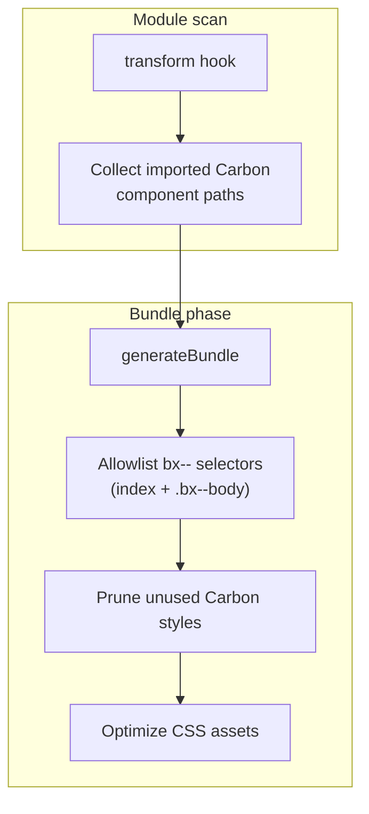

# carbon-preprocess-svelte

[![NPM][npm]][npm-url]


> Zero-dependency Svelte preprocessors and build plugins for the [Carbon Design System](https://carbondesignsystem.com/).

## Installation

Install `carbon-preprocess-svelte` as a development dependency.

```sh
# npm
npm i -D carbon-preprocess-svelte

# pnpm
pnpm i -D carbon-preprocess-svelte

# Yarn
yarn add -D carbon-preprocess-svelte

# Bun
bun add -D carbon-preprocess-svelte
```

## Usage

Pick the tool for your bundler or pipeline; each works on its own.

| Tool | Type | Works with | What it does |
| :--- | :--- | :--- | :--- |
| [`optimizeImports`](#optimizeimports) | Svelte preprocessor | Any bundler | Rewrites Carbon imports to source paths, for faster dev and build times |
| [`optimizeCss`](#optimizecss) | Build plugin | Vite, Rollup, Rolldown | Prunes unused Carbon styles, shrinking CSS bundles up to 90% |
| [`optimizeComponents`](#optimizecomponents) | Build plugin | Vite, Rollup, Rolldown, Astro | Rewrites Carbon components for the props your app passes, removing code it never runs |
| [`OptimizeCssPlugin`](#optimizecssplugin) | Build plugin | Webpack, Rspack | `optimizeCss` for Webpack and Rspack |
| [`OptimizeComponentsPlugin`](#optimizecomponentsplugin) | Build plugin | Webpack, Rspack | `optimizeComponents` for Webpack and Rspack |
| [`optimizeCarbonCss`](#optimizecarboncss) | Async function | esbuild, `Bun.build`, any post-build script | The CSS engine as a function, for any pipeline |
| [CLI](#cli) | Command | esbuild, Bun, any pipeline without a plugin hook | Prunes built CSS files with one command |

### `optimizeImports`

Rewrites barrel imports from [carbon-components-svelte](https://github.com/carbon-design-system/carbon-components-svelte), [carbon-icons-svelte](https://github.com/carbon-design-system/carbon-icons-svelte) and [carbon-pictograms-svelte](https://github.com/carbon-design-system/carbon-pictograms-svelte) to their source paths. Svelte compiles less, and your editor keeps its autocomplete.

```diff
- import { Button } from "carbon-components-svelte";
+ import Button from "carbon-components-svelte/src/Button/Button.svelte";

- import { Add } from "carbon-icons-svelte";
+ import Add from "carbon-icons-svelte/lib/Add.svelte";

- import { Airplane } from "carbon-pictograms-svelte";
+ import Airplane from "carbon-pictograms-svelte/lib/Airplane.svelte";
```

- Paths come from your installed Carbon's own `src/index.js`, so they match your version.
- Utilities stay named imports (`import { toCsv } from "carbon-components-svelte/src/DataTable/data-table-utils.js"`), and names the barrel doesn't export stay on the barrel.

> [!NOTE]
> Vite's [`prebundleSvelteLibraries`](https://github.com/sveltejs/vite-plugin-svelte/blob/ba4ac32cf5c3e9c048d1ac430c1091ca08eaa130/docs/config.md#prebundlesveltelibraries), now on by default, covers the same cold-start problem. This preprocessor still helps non-Vite bundlers (Rollup, Webpack) and can shave Vite's cold start further.

**Set-ups:** [SvelteKit](#sveltekit) · [Vite](#vite) · [Rollup](#rollup) · [Webpack](#webpack) · [Rspack](#rspack)

#### SvelteKit

Full set-up: [examples/sveltekit](examples/sveltekit). SvelteKit 3 takes its options in the `sveltekit()` plugin:

```js
// vite.config.js
import adapter from "@sveltejs/adapter-static";
import { sveltekit } from "@sveltejs/kit/vite";
import { vitePreprocess } from "@sveltejs/vite-plugin-svelte";
import { optimizeImports } from "carbon-preprocess-svelte";

export default {
  plugins: [
    sveltekit({
      // In sequence: transpile TypeScript first.
      preprocess: [vitePreprocess(), optimizeImports()],
      adapter: adapter(),
    }),
  ],
};
```

SvelteKit 2: pass the same `preprocess` in `svelte.config.js`, and the adapter under `kit`.

#### Vite

Full set-up: [examples/vite](examples/vite).

```js
// vite.config.js
import { svelte, vitePreprocess } from "@sveltejs/vite-plugin-svelte";
import { optimizeImports } from "carbon-preprocess-svelte";

export default {
  plugins: [
    // In sequence: transpile TypeScript first.
    svelte({ preprocess: [vitePreprocess(), optimizeImports()] }),
  ],
};
```

#### Rollup

Abridged; full set-up: [examples/rollup](examples/rollup).

```js
// rollup.config.js
import svelte from "rollup-plugin-svelte";
import { optimizeImports } from "carbon-preprocess-svelte";

export default {
  plugins: [svelte({ preprocess: [optimizeImports()] })],
};
```

#### Webpack

Abridged; full set-up: [examples/webpack](examples/webpack).

```js
// webpack.config.mjs
import { optimizeImports } from "carbon-preprocess-svelte";

export default {
  module: {
    rules: [
      {
        test: /\.svelte$/,
        use: {
          loader: "svelte-loader",
          options: { preprocess: [optimizeImports()] },
        },
      },
    ],
  },
};
```

#### Rspack

[Rspack](https://rspack.rs) implements webpack's loader API, so the [Webpack](#webpack) set-up works unchanged in `rspack.config.mjs`. Full set-up: [examples/rspack](examples/rspack).

### `optimizeCss`

A build plugin that strips unused Carbon styles. It runs on Vite, Rollup and [Rolldown](https://rolldown.rs), which share a plugin API.

```diff
$ vite build

Optimized index-CU4gbKFa.css
- Before: 606.26 kB
+ After:   53.22 kB (-91.22%)
```

> [!NOTE]
> It's a build plugin, not a preprocessor: add it to `plugins`. Vite runs it on `vite build` only; under Rollup and Rolldown, add it to production builds only.

<details>
<summary>How it works</summary>

It runs on production builds, after other plugins (`apply: "build"`, `enforce: "post"`).

1. **`transform`:** collects the Carbon components the app imports, and (unless `scanModules: false`) every literal `bx--` token in other modules.
2. **`generateBundle`:** for each CSS file, builds an allowlist of the `bx--` classes those components use, plus globals like `.bx--body`. The class index comes from your installed Carbon (see [Component index](#component-index)).
3. **Prune** Carbon selectors outside the allowlist:
   - from a selector list, only the branches that don't match;
   - a compound selector only survives if every Carbon class in it does, so NumberInput doesn't pull in `.bx--modal .bx--number`;
   - flatpickr and legacy `bx-` rules go unless a flatpickr-based component (DatePicker) is bundled;
   - `:is(…)` and `:not(…)` groups are parsed, not split on commas.
4. Empty rules are dropped.

Validated against most Carbon components and common multi-component bundles with no unexplained survivors. Its one blind spot is in the warning under the [API](#optimizecss-api): class names that never appear as a literal `bx--` token.


```mermaid
flowchart TB
  subgraph scan["Module scan"]
    T[transform hook] --> S["Collect imported Carbon<br/>component paths"]
  end
  subgraph emit["Bundle phase"]
    S --> G[generateBundle]
    G --> A["Allowlist bx-- selectors<br/>(index + .bx--body)"]
    A --> P[Prune unused Carbon styles]
    P --> R[Optimize CSS assets]
  end

  class T,G hook
  class S,A data
  class P,R css
```

</details>

**Set-ups:** [SvelteKit](#sveltekit-1) · [Astro](#astro) · [Vite](#vite-1) · [Rollup](#rollup-1) · [Rolldown](#rolldown) · [API reference](#optimizecss-api)

#### SvelteKit

Full set-up: [examples/sveltekit](examples/sveltekit).

```js
// vite.config.js
import { sveltekit } from "@sveltejs/kit/vite";
import { optimizeCss } from "carbon-preprocess-svelte";

export default {
  plugins: [sveltekit(), optimizeCss()],
};
```

#### Astro

Full set-up: [examples/astro](examples/astro).

```js
// astro.config.mjs
import svelte from "@astrojs/svelte";
import { optimizeCss } from "carbon-preprocess-svelte";
import { defineConfig } from "astro/config";

export default defineConfig({
  integrations: [svelte()],
  // Optional: keep CSS in its own file, so the pruned output is easy to inspect.
  build: { inlineStylesheets: "never" },
  vite: { plugins: [optimizeCss()] },
});
```

#### Vite

Full set-up: [examples/vite](examples/vite).

```js
// vite.config.js
import { svelte } from "@sveltejs/vite-plugin-svelte";
import { optimizeCss } from "carbon-preprocess-svelte";

export default {
  plugins: [svelte(), optimizeCss()],
};
```

#### Rollup

Abridged; full set-up: [examples/rollup](examples/rollup).

```js
// rollup.config.js
import svelte from "rollup-plugin-svelte";
import { optimizeCss, optimizeImports } from "carbon-preprocess-svelte";

const production = !process.env.ROLLUP_WATCH;

export default {
  plugins: [
    svelte({ preprocess: [optimizeImports()] }),
    production && optimizeCss(), // production builds only
  ],
};
```

#### Rolldown

Abridged; full set-up: [examples/rolldown](examples/rolldown).

```js
// rolldown.config.ts
import { optimizeCss, optimizeImports } from "carbon-preprocess-svelte";
import svelte from "rollup-plugin-svelte";

const production = process.env.NODE_ENV === "production";

export default {
  plugins: [
    svelte({ preprocess: [optimizeImports()] }),
    production && optimizeCss(), // production builds only
  ],
};
```

#### `optimizeCss` API

```ts
optimizeCss({
  /**
   * Set to `true` to suppress the size difference
   * logging between original and optimized CSS.
   * Under Vite the size log also follows `logLevel` and `customLogger`,
   * so `--logLevel warn` hides it without setting `silent`.
   * @default false
   */
  silent: true,

  /**
   * Run the whole pipeline and print the size log, but leave every CSS
   * asset unchanged. Use it to preview the reduction and check the output
   * before enabling pruning in a production build.
   * @default false
   */
  dryRun: true,

  /**
   * Print a per-build summary of what the plugin detected: imported Carbon
   * components, allowlist size and its sources (module scan, `content`,
   * `safelist`), and per-asset results. Independent of `silent`.
   * @default false
   */
  report: true,

  /**
   * By default, pre-compiled Carbon StyleSheets ship `@font-face` rules
   * for all available IBM Plex fonts, many of which are not actually
   * used in Carbon Svelte components.
   *
   * The default behavior is to preserve the following IBM Plex fonts:
   * - IBM Plex Sans (300/400/600-weight rules; italic only if `<Text italic>` is used)
   * - IBM Plex Mono (400-weight and normal-font-style rules)
   *
   * Set to `true` to disable this behavior and
   * retain *all* IBM Plex `@font-face` rules.
   * @default false
   */
  preserveAllIBMFonts: true,

  /**
   * Class selectors to always keep, regardless of which components are
   * imported. Use for Carbon classes the allowlist misses: hand-written
   * classes in app markup (e.g. `<div class="bx--grid">`) and theme/layout
   * utilities that no component file references.
   *
   * Each entry is either:
   * - a `string`, matched literally as a complete class token. `.bx--grid`
   *   keeps `.bx--grid` and `.bx--grid:hover`, but not `.bx--grid--wide`
   * - a `RegExp`, tested against the whole selector. `/^\.bx--btn--/` keeps
   *   every `.bx--btn--*` variant
   *
   * @default []
   */
  safelist: [".bx--grid", ".bx--aspect-ratio", /^\.bx--btn--/],

  /**
   * Glob patterns (relative to the project root: Vite `root`, webpack/Rspack
   * `context`, or the working directory under plain Rollup) of source files
   * to scan for literal `bx--`-prefixed tokens. Every token found is kept.
   * Use when class names are built at runtime. See the warning below.
   *
   * A pattern that matches no files raises a bundler warning naming the root
   * it was resolved from.
   *
   * @default undefined
   */
  content: ["src/**/*.{svelte,js,ts}"],

  /**
   * Scan the code of every bundled module for literal `bx--` tokens and keep
   * them, so hand-written Carbon classes in your own markup
   * (`<div class="bx--grid">`) and prefix literals (`` `bx--btn--${kind}` ``)
   * survive without configuration. Carbon's own sources, CSS modules, and
   * virtual modules are skipped. Set to `false` to rely only on imported
   * components, `safelist`, and `content`.
   * @default true
   */
  scanModules: false,

  /**
   * Also prune styles for the prop values the app never passes.
   * See "Prop-aware pruning" below.
   * @default false
   */
  propAware: true,
});
```

> [!WARNING]
> **A class name that never appears as a literal `bx--` token can't be detected**, and gets pruned:
>
> ```svelte
> <script>
>   const p = "bx-" + "-btn"; // "bx--btn" never appears as one token
> </script>
> <button class={`${p}--${kind}`}>...</button>
> ```
>
> The same goes for files the bundler never processes (Markdown, HTML templates, CMS content). Fixes:
>
> | Fix | Example |
> | :--- | :--- |
> | Keep selectors explicitly | `safelist: [".bx--grid", /^\.bx--btn--/]` |
> | Scan extra files for tokens | `content: ["**/*.{md,html}"]` |
> | See what was detected | `report: true` |

#### Prop-aware pruning

`propAware` also reads the props your app passes, and prunes the variants it never uses:

```js
optimizeCss({ propAware: true });
```

```svelte
<Button kind="tertiary">Save</Button>
<!-- kept:   .bx--btn, .bx--btn--tertiary
     pruned: the other kinds and sizes, .bx--skeleton, the icon-only tooltip -->
```

What it reads:

| In your app | Example |
| :--- | :--- |
| Literal props | `<Button kind="ghost">` |
| Constants, and state no code reassigns | `const kind = "ghost"`, `let size = $state("small")`, or a string or number your own modules export: `import { KIND } from "./constants"` |
| Your own wrapper components | `<ActionButton primary>` reaching `<Button kind={primary ? "tertiary" : "ghost"}>` |
| Props Carbon passes to its own children | `Modal` rendering `Button` |
| Props a component forwards to a child | `{...$$restProps}`, or `...rest` from `$props()` |
| Object and array literals nothing changes | `secondaryButtons={[{ text: "Back", kind: "ghost" }]}`, read as `button.kind` in `{#each}` |
| Your own `{#if}` and `{#each}` | a call site in a branch that can't render doesn't count |

What keeps every variant (it errs toward keeping styles):

| Case | Example |
| :--- | :--- |
| A value it can't read | a reassigned variable, a store, a function call |
| `bind:`, or spreading anything but a component's own props | `bind:open`, `{...props}` |
| A component used as a value | `<svelte:component this={Button}>`, passed as a prop, imported in a `.js`/`.ts` file |
| Markup it can't see | imported but never rendered as a tag (another preprocessor's output) |
| A wrapper rendered from outside the analyzed files | a route or entry the framework mounts, `import.meta.glob` |

Imports through an alias (`#lib/Card.svelte` in SvelteKit 3, `$lib/Card.svelte` before it) are resolved with the bundler's own resolver. Without a bundler (`optimizeCarbonCss`, the CLI), a component imported through an alias renders with any props. If the analysis fails, the build warns and prunes without it. To tune it:

```js
optimizeCss({
  propAware: {
    // Keep every variant's styles for these components.
    exclude: ["DataTable"],
    // Values for props set from expressions; a value not listed loses its styles.
    assume: { Button: { kind: ["primary", "danger"] } },
  },
});
```

`report: true` prints each component's prop values, and for each value it can't read, where and why it was lost:

```
Button (4 call sites)
  kind             dynamic (+ default): Modal.svelte:279 reads `button.kind`
DataTable (1 call site)
  page             dynamic: App.svelte:231 `page` is bound with `bind:` at line 253
```
 The same options work on `OptimizeCssPlugin`, `optimizeCarbonCss` (which needs `content`), and the CLI (`--prop-aware`).

Across 2,416 apps covering every Carbon component and prop value, it left 36% less CSS than default pruning, and no class those apps render lost its rules. To also remove the code for the pruned branches, add [`optimizeComponents`](#optimizecomponents).

#### `optimizeComponents`

Rewrites each Carbon component your app renders for the props it passes: values that never change become literals, and branches that can't run go, along with the child components only they render (a skeleton, a tooltip portal). It's the JavaScript counterpart of prop-aware pruning, using the same analysis.

```js
// vite.config.js
import { svelte } from "@sveltejs/vite-plugin-svelte";
import { optimizeComponents, optimizeCss } from "carbon-preprocess-svelte";

export default {
  plugins: [
    optimizeComponents(), // before svelte(): it hands Svelte the rewritten source
    svelte(),
    optimizeCss({ propAware: true }),
  ],
};
```

```ts
optimizeComponents({
  /**
   * Globs (relative to the Vite root) of every file that renders Carbon
   * components. They're analyzed before the build; a module outside them
   * that imports a Carbon component fails the build. Components a script,
   * Markdown, MDX or Astro file imports keep every prop value.
   * `node_modules` is skipped unless a pattern names it.
   * @default ["src/**\/*.{svelte,svx,md,mdx,astro,js,jsx,ts,tsx,mjs,mts,cjs,cts}"]
   */
  content: ["src/**/*.{svelte,ts}"],

  /**
   * Replace an `{#if}` whose live branch is known with that branch instead
   * of keeping an `{#if true}` around it. Svelte 5 only. Saves under a
   * point of JS.
   * @default true when the installed Svelte is 5 or later
   */
  unwrap: true,

  /** Skip the per-build summary. @default false */
  silent: false,

  /**
   * Print what each build rewrote: edits per component, the child
   * components they no longer render and the ones no longer bundled, and
   * the prop values each call site passes. @default false
   */
  report: false,
});
```

Where it runs:

| Bundler | Plugin order | Runs on |
| :--- | :--- | :--- |
| Vite, SvelteKit, Astro (`vite.plugins`) | first, automatically | `vite build` and `vite build --watch`; never `vite dev` |
| Rollup, Rolldown | list it before the Svelte plugin | wherever you add it, so add it to production builds only (`content` resolves from the working directory) |
| webpack, Rspack | first, automatically; see [`OptimizeComponentsPlugin`](#optimizecomponentsplugin) | `mode: "production"` only |

It skips dev servers because it analyzes the whole app up front, dev rebuilds of single modules would leave rewritten components stale, and its safety check needs the complete build.

- **Fails the build instead of shipping wrong code** if a module outside `content` imports a Carbon component, or a wrapper whose props were read from its call sites.
- **SvelteKit and Astro:** the server and client builds are rewritten alike, so prerendered pages hydrate as before.
- **Watch mode:** a rebuild reanalyzes `content` only when a file in it changed.
- **Source maps** point devtools and stack traces at Carbon's original source.
- **Same output:** across every Carbon component and prop value, the rewritten components render identical HTML on Svelte 3, 4 and 5, and every example's optimized build renders the same DOM and pixels through scripted clicks, menus, modals and tooltips.

JavaScript removed in the examples:

| Example | JS removed |
| :--- | :--- |
| [vite-matrix](examples/vite-matrix@svelte-4), Svelte 4 / 5 | 27% / 20% |
| [SvelteKit](examples/sveltekit-matrix@svelte-5) | 18% |
| [Astro](examples/astro) | 14% |
| Rollup, Rolldown, webpack (Svelte 4) | 26–28% |
| webpack, Rspack (Svelte 5) | 9–12% (the Svelte 5 runtime is a larger share of a small app) |

#### `OptimizeComponentsPlugin`

`optimizeComponents` for webpack and Rspack, with the same options. It runs in production mode only, and its pre-loader runs before `svelte-loader` wherever the plugin is listed.

```js
// webpack.config.mjs (or rspack.config.mjs)
import {
  OptimizeComponentsPlugin,
  OptimizeCssPlugin,
} from "carbon-preprocess-svelte";

export default {
  plugins: [
    new OptimizeComponentsPlugin(),
    new OptimizeCssPlugin({ propAware: true }),
  ],
};
```

### `OptimizeCssPlugin`

`optimizeCss` for Webpack and [Rspack](https://rspack.rs): same options, production mode only. One instance works on both, since Rspack implements webpack's plugin API.

```js
// webpack.config.mjs (or rspack.config.mjs)
import { OptimizeCssPlugin } from "carbon-preprocess-svelte";

export default {
  plugins: [new OptimizeCssPlugin()],
};
```

Full set-ups: [examples/webpack](examples/webpack), [examples/webpack@svelte-5](examples/webpack@svelte-5), [examples/rspack](examples/rspack).

### `optimizeCarbonCss`

The engine behind `optimizeCss`, as an async function, for pipelines without a plugin API (esbuild, `Bun.build`, a post-build script). It can't see your imports, so you pass the `components`. It shares the plugins' [blind spot](#optimizecss-api).

> [!TIP]
> Can your pipeline run a command after the build? The [CLI](#cli) detects components for you, with no code.

```js
// esbuild
import { writeFileSync } from "node:fs";
import { optimizeCarbonCss } from "carbon-preprocess-svelte";
import { build } from "esbuild";

const result = await build({
  entryPoints: ["src/main.js"],
  bundle: true,
  write: false,
  outdir: "dist",
});

const components = ["Button", "Accordion"];
const sources = result.outputFiles
  .filter((file) => file.path.endsWith(".js"))
  .map((file) => file.text);

for (const file of result.outputFiles) {
  if (!file.path.endsWith(".css")) continue;
  const { css } = await optimizeCarbonCss(file.text, { components, sources });
  writeFileSync(file.path, css);
}
```

<details>
<summary><code>Bun.build</code></summary>

```js
import { optimizeCarbonCss } from "carbon-preprocess-svelte";

const result = await Bun.build({ entrypoints: ["src/main.js"], outdir: "dist" });

const components = ["Button", "Accordion"];
const sources = await Promise.all(
  result.outputs
    .filter((output) => output.kind === "entry-point")
    .map((output) => output.text()),
);

for (const output of result.outputs) {
  if (!output.path.endsWith(".css")) continue;
  const { css } = await optimizeCarbonCss(await output.text(), {
    components,
    sources,
  });
  await Bun.write(output.path, css);
}
```

</details>

```ts
optimizeCarbonCss(css, {
  /**
   * Carbon components used by the app, as names (`"Button"`) or paths to
   * their `.svelte` source. Classes referenced by these components are kept.
   * An empty list returns the CSS unchanged.
   */
  components: ["Button", "Accordion"],

  /**
   * Source code to scan for literal `bx--` tokens, for example the JS output
   * of your bundler. Same detection as the plugins' `scanModules`.
   * @default undefined
   */
  sources: [],

  /**
   * Project directory: `content` globs and the installed
   * `carbon-components-svelte` resolve from it.
   * @default process.cwd()
   */
  cwd: process.cwd(),

  /**
   * Class selectors to always keep, regardless of which components are
   * imported. See the `optimizeCss` API above for the string vs. `RegExp`
   * matching rules.
   * @default []
   */
  safelist: [".bx--grid", ".bx--aspect-ratio", /^\.bx--btn--/],

  /**
   * Set to `true` to retain *all* IBM Plex `@font-face` rules instead of
   * only the ones Carbon Svelte components actually use.
   * @default false
   */
  preserveAllIBMFonts: false,

  /**
   * Glob patterns of source files to scan for literal `bx--`-prefixed
   * tokens. Every token found is kept. Resolves relative to `cwd`.
   * @default undefined
   */
  content: ["src/**/*.{svelte,js,ts}"],

  /**
   * See "Prop-aware pruning" under `optimizeCss`. Reads call sites from the
   * `content` files, so `content` must cover every file that renders Carbon
   * components; a listed component no file renders keeps every variant.
   */
  propAware: true,
});
```

### CLI

Prunes built CSS files in place, for pipelines with no plugin hook. It finds the components to keep by scanning `--content` files for Carbon imports (barrel or direct paths) and literal `bx--` tokens, and shares the plugins' [blind spot](#optimizecss-api).

**Jump to:** [Command](#command) · [Sample output](#sample-output) · [Options](#options)

#### Command

```sh
npx carbon-preprocess-svelte optimize-css "dist/**/*.css"
```

Run it after the build step:

```json
{
  "scripts": {
    "build": "esbuild src/main.ts --bundle --outdir=dist && carbon-preprocess-svelte optimize-css \"dist/**/*.css\""
  }
}
```

With Bun, the build step is `bun build src/main.ts --outdir dist`.

#### Sample output

```diff
$ carbon-preprocess-svelte optimize-css "dist/**/*.css"

Optimized dist/assets/index-CU4gbKFa.css
- Before: 606.26 kB
+ After:   53.22 kB (-91.22%)
```

With `--report`:

```
carbon-preprocess-svelte report
  Detected components (2): Button, Accordion
  Allowlist: 128 classes (module scan 0 tokens, content 12 tokens, safelist 3 entries)
  Assets:
    dist/assets/index-CU4gbKFa.css   1,204 rules removed   606.26 kB -> 53.22 kB
```

#### Options

```
Usage: carbon-preprocess-svelte optimize-css [options] <css-file-or-glob>...

Removes unused Carbon styles from built CSS files, in place.
Carbon components are detected from imports in the files matched by --content.

Options:
  --content <glob>        Source files to scan for Carbon imports and literal
                          bx-- classes. Repeatable. Default: src/**/*.{svelte,js,ts,mjs}
  --components <a,b,c>    Component names to keep in addition to detected ones.
  --safelist <selector>   Class selector to always keep. Repeatable. Wrap in
                          slashes for a RegExp: --safelist "/^\.bx--btn--/"
  --preserve-all-ibm-fonts
                          Keep every IBM Plex @font-face rule.
  --prop-aware            Also prune styles for prop values, slots, and child
                          components the --content files never use.
  --cwd <dir>             Project directory; globs and carbon-components-svelte
                          resolve from it. Default: process.cwd()
  --dry-run               Print sizes, write nothing.
  --report                Print detected components and allowlist summary.
  --silent                Suppress the per-file size log.
  -h, --help              Show this help.
```

## Component index

The CSS tools (`optimizeCss`, `OptimizeCssPlugin`, `optimizeCarbonCss`, the CLI) prune against an index of the `bx--` classes each Carbon component renders, built from your installed `carbon-components-svelte`, so it matches your version, older or newer than this package.

| | |
| :--- | :--- |
| Parsing | With [sveast](https://github.com/metonym/sveast), bundled in, so your project's `svelte` version doesn't matter |
| Cost | Built once, well under a second |
| Cache | `node_modules/.cache/carbon-preprocess-svelte/<carbon-version>_<preprocessor-version>.json`; bumping either package rebuilds it. A linked Carbon checkout (`bun link`, `npm link`, `workspace:`) isn't cached, so source edits apply on the next build. |
| On failure | The build warns and leaves Carbon CSS unpruned, instead of failing |

`optimizeImports` doesn't use it: it reads import paths from Carbon's `src/index.js`.

## Examples

Runnable set-ups for every supported bundler, under [examples](examples):

| Example | Bundler | Svelte | Notes |
| :--- | :--- | :--- | :--- |
| [sveltekit](examples/sveltekit) | SvelteKit | 5 | |
| [vite](examples/vite) | Vite | 4 | |
| [vite@svelte-5](examples/vite@svelte-5) | Vite | 5 | |
| [vite@carbon-0.85](examples/vite@carbon-0.85) | Vite | 4 | Pinned to Carbon 0.85.0 |
| [vite-matrix@svelte-4](examples/vite-matrix@svelte-4), [@svelte-5](examples/vite-matrix@svelte-5) | Vite | 4, 5 | One app built four ways, from no optimization to `optimizeComponents`, with a size table |
| [sveltekit-matrix@svelte-5](examples/sveltekit-matrix@svelte-5) | SvelteKit | 5 | The same app and comparison, prerendered and hydrated |
| [astro](examples/astro) | Astro | 5 | `build:optimized` script |
| [rollup](examples/rollup) | Rollup | 4 | `build:optimized` script |
| [rolldown](examples/rolldown) | Rolldown | 4 | `build:optimized` script |
| [webpack](examples/webpack) | Webpack | 4 | `build:optimized` script |
| [webpack@svelte-5](examples/webpack@svelte-5) | Webpack | 5 | `build:optimized` script |
| [rspack](examples/rspack) | Rspack | 5 | `build:optimized` script |

A `build:optimized` script adds `optimizeComponents` and prop-aware CSS.

## License

[Apache 2.0](LICENSE)

[npm]: https://img.shields.io/npm/v/carbon-preprocess-svelte.svg?color=262626&style=for-the-badge
[npm-url]: https://npmjs.com/package/carbon-preprocess-svelte
