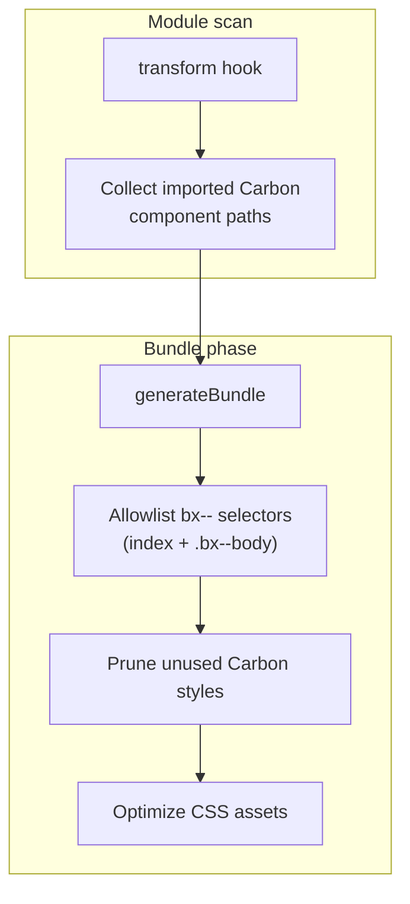

# carbon-preprocess-svelte

[![NPM][npm]][npm-url]


> Zero-dependency Svelte preprocessors and build plugins for the [Carbon Design System](https://carbondesignsystem.com/).

## Installation

Install `carbon-preprocess-svelte` as a development dependency.

```sh
# npm
npm i -D carbon-preprocess-svelte

# pnpm
pnpm i -D carbon-preprocess-svelte

# Yarn
yarn add -D carbon-preprocess-svelte

# Bun
bun add -D carbon-preprocess-svelte
```

## Usage

This package has six independent tools; pick the one matching your bundler or pipeline.

| Tool | Type | Works with | Description |
| :--- | :--- | :--- | :--- |
| [`optimizeImports`](#optimizeimports) | Svelte preprocessor | Any bundler | Rewrites Carbon imports straight to source, for faster dev and build times |
| [`optimizeCss`](#optimizecss) | Build plugin | Vite, Rollup, Rolldown | Prunes unused Carbon styles at build time, shrinking CSS bundles up to 90% |
| [`optimizeComponents`](#optimizecomponents-experimental) | Build plugin (experimental) | Vite, Rollup, Rolldown | Rewrites Carbon components for the props your app passes, removing code it never runs |
| [`OptimizeCssPlugin`](#optimizecssplugin) | Build plugin | Webpack, Rspack | `optimizeCss` for Webpack and Rspack |
| [`optimizeCarbonCss`](#optimizecarboncss) | Async function | esbuild, Bun.build, any post-build script | Programmatic version of the same CSS optimization engine, for any pipeline |
| [CLI](#cli) | Command-line tool | esbuild, Bun, any pipeline without a plugin hook | Prunes unused Carbon styles from built CSS files with a single command |

### `optimizeImports`

`optimizeImports` rewrites barrel imports from Carbon's components/icons/pictograms packages to their source Svelte paths, speeding up dev and build compile times while preserving IDE typeahead and autocomplete.

The preprocessor optimizes imports from the following packages:

- [carbon-components-svelte](https://github.com/carbon-design-system/carbon-components-svelte)
- [carbon-icons-svelte](https://github.com/carbon-design-system/carbon-icons-svelte)
- [carbon-pictograms-svelte](https://github.com/carbon-design-system/carbon-pictograms-svelte)

```diff
- import { Button } from "carbon-components-svelte";
+ import Button from "carbon-components-svelte/src/Button/Button.svelte";

- import { Add } from "carbon-icons-svelte";
+ import Add from "carbon-icons-svelte/lib/Add.svelte";

- import { Airplane } from "carbon-pictograms-svelte";
+ import Airplane from "carbon-pictograms-svelte/lib/Airplane.svelte";
```

> [!NOTE]
> This preprocessor predates [@sveltejs/vite-plugin-svelte](https://github.com/sveltejs/vite-plugin-svelte)'s [`prebundleSvelteLibraries: true`](https://github.com/sveltejs/vite-plugin-svelte/blob/ba4ac32cf5c3e9c048d1ac430c1091ca08eaa130/docs/config.md#prebundlesveltelibraries), now the default, which covers the same Vite cold-start problem. It's still useful for non-Vite bundlers like Rollup and Webpack, and can further improve cold start even with `prebundleSvelteLibraries: true`.

Component paths are read from your installed `carbon-components-svelte`'s own `src/index.js`, so they always match the version you have. Utilities exported by name stay named imports (`import { toCsv } from "carbon-components-svelte/src/DataTable/data-table-utils.js"`), and names that barrel doesn't export are left on the barrel.

**Set-ups:** [SvelteKit](#sveltekit) · [Vite](#vite) · [Rollup](#rollup) · [Webpack](#webpack) · [Rspack](#rspack)

#### SvelteKit

See [examples/sveltekit](examples/sveltekit). SvelteKit 3 takes its options in the `sveltekit()` Vite plugin:

```js
// vite.config.js
import adapter from "@sveltejs/adapter-static";
import { sveltekit } from "@sveltejs/kit/vite";
import { vitePreprocess } from "@sveltejs/vite-plugin-svelte";
import { optimizeImports } from "carbon-preprocess-svelte";

export default {
  plugins: [
    sveltekit({
      preprocess: [
        // Preprocessors are run in sequence.
        // If using TypeScript, the code must be transpiled first.
        vitePreprocess(),
        optimizeImports(),
      ],
      adapter: adapter(),
    }),
  ],
};
```

With SvelteKit 2, pass the same `preprocess` in `svelte.config.js` (and the adapter under `kit`).

#### Vite

See [examples/vite](examples/vite).

```js
// vite.config.js
import { svelte } from "@sveltejs/vite-plugin-svelte";
import { vitePreprocess } from "@sveltejs/vite-plugin-svelte";
import { optimizeImports } from "carbon-preprocess-svelte";

/** @type {import('vite').UserConfig} */
export default {
  plugins: [
    svelte({
      preprocess: [
        // Preprocessors are run in sequence.
        // If using TypeScript, the code must be transpiled first.
        vitePreprocess(),
        optimizeImports(),
      ],
    }),
  ],
};
```

#### Rollup

This code is abridged; see [examples/rollup](examples/rollup) for a full set-up.

```js
// rollup.config.js
import svelte from "rollup-plugin-svelte";
import { optimizeImports } from "carbon-preprocess-svelte";

export default {
  plugins: [
    svelte({
      preprocess: [optimizeImports()],
    }),
  ],
};
```

#### Webpack

This code is abridged; see [examples/webpack](examples/webpack) for a full set-up.

```js
// webpack.config.mjs
import { optimizeImports } from "carbon-preprocess-svelte";

export default {
  module: {
    rules: [
      {
        test: /\.svelte$/,
        use: {
          loader: "svelte-loader",
          options: {
            hotReload: !PROD,
            preprocess: [optimizeImports()],
            compilerOptions: { dev: !PROD },
          },
        },
      },
    ],
  },
};
```

#### Rspack

[Rspack](https://rspack.rs) implements webpack's plugin and loader APIs, so setup matches [Webpack](#webpack) above unchanged. This code is abridged; see [examples/rspack](examples/rspack) for a full set-up.

```js
// rspack.config.mjs
import { optimizeImports } from "carbon-preprocess-svelte";

export default {
  module: {
    rules: [
      {
        test: /\.svelte$/,
        use: {
          loader: "svelte-loader",
          options: {
            hotReload: !PROD,
            preprocess: [optimizeImports()],
            compilerOptions: { dev: !PROD },
          },
        },
      },
    ],
  },
};
```

### `optimizeCss`

`optimizeCss` is a Vite plugin that strips unused Carbon styles at build time. It also works with Rollup and [Rolldown](https://rolldown.rs), which share the same plugin API ([Vite](https://vitejs.dev/guide/api-plugin) extends Rollup's).

<details>
<summary>How it works</summary>

The plugin uses `apply: "build"` and `enforce: "post"`, so it runs only on production builds and after other plugins.

1. During `transform`, it collects imported `carbon-components-svelte` source paths, plus (unless `scanModules: false`) every literal `bx--` token found in other modules.
2. During `generateBundle`, for each emitted CSS file it builds an allowlist of every `bx--` class tied to those components, plus global selectors like `.bx--body`. The component-to-class index is built from your installed `carbon-components-svelte` (see [Component index](#component-index)), so it always matches the version you have.
3. A CSS filter prunes Carbon (`bx--`) selectors outside that allowlist:
   - Individual selectors are pruned from comma-separated lists, not the whole rule, when only one branch matches
   - Every Carbon class in a compound selector (same-element and descendant) must match the allowlist, so importing NumberInput doesn't pull in `.bx--modal .bx--number` context rules, and Button doesn't pull in Tabs skeleton styles via a shared `.bx--skeleton` modifier
   - Flatpickr and legacy single-hyphen `bx-` rules are dropped unless DatePicker (or another flatpickr-based component) is in the bundle
   - Selectors are parsed with parenthesis-awareness, handling `:is(...)` and `:not(...)` groups instead of naively splitting on commas
4. Empty rules are discarded, and the CSS bundles are optimized.

**Risk profile:** validated against a fixture suite covering most Carbon components and common multi-component bundles ([`tests/fixtures/optimize-css`](tests/fixtures/optimize-css)) with zero unexplained survivors, but it shares the blind spot in the warning below: class names that never appear as a literal `bx--` token in bundled code.


```mermaid
flowchart TB
  subgraph scan["Module scan"]
    T[transform hook] --> S["Collect imported Carbon<br/>component paths"]
  end
  subgraph emit["Bundle phase"]
    S --> G[generateBundle]
    G --> A["Allowlist bx-- selectors<br/>(index + .bx--body)"]
    A --> P[Prune unused Carbon styles]
    P --> R[Optimize CSS assets]
  end

  class T,G hook
  class S,A data
  class P,R css
```

</details>

```diff
$ vite build

Optimized index-CU4gbKFa.css
- Before: 606.26 kB
+ After:   53.22 kB (-91.22%)

dist/index.html                  0.34 kB │ gzip:  0.24 kB
dist/assets/index-CU4gbKFa.css  53.22 kB │ gzip:  6.91 kB
dist/assets/index-Ceijs3eO.js   53.65 kB │ gzip: 15.88 kB
```

> [!NOTE]
> This is a plugin, not a Svelte preprocessor. Add it to `vite.plugins`. Under Vite it only runs on `vite build`, never during dev. Under Rollup and Webpack, apply it conditionally so it only runs for production builds.

**Set-ups:** [SvelteKit](#sveltekit-1) · [Astro](#astro) · [Vite](#vite-1) · [Rollup](#rollup-1) · [Rolldown](#rolldown) · [API reference](#optimizecss-api)

#### SvelteKit

See [examples/sveltekit](examples/sveltekit).

```js
// vite.config.js
import { sveltekit } from "@sveltejs/kit/vite";
import { optimizeCss } from "carbon-preprocess-svelte";
import { defineConfig } from "vite";

export default defineConfig({
  plugins: [sveltekit(), optimizeCss()],
});
```

#### Astro

See [examples/astro](examples/astro).

```js
// astro.config.mjs
import svelte from "@astrojs/svelte";
import { optimizeCss } from "carbon-preprocess-svelte";
import { defineConfig } from "astro/config";

export default defineConfig({
  integrations: [svelte()],
  build: {
    // Keep CSS as a separate asset so the pruned output is visible.
    inlineStylesheets: "never",
  },
  vite: {
    plugins: [optimizeCss()],
  },
});
```

`inlineStylesheets: "never"` just makes the pruned asset inspectable; it's not required.

#### Vite

See [examples/vite](examples/vite).

```js
// vite.config.js
import { svelte } from "@sveltejs/vite-plugin-svelte";
import { optimizeCss } from "carbon-preprocess-svelte";

/** @type {import('vite').UserConfig} */
export default {
  plugins: [svelte(), optimizeCss()],
};
```

#### Rollup

This code is abridged; see [examples/rollup](examples/rollup) for a full set-up.

```js
// rollup.config.js
import svelte from "rollup-plugin-svelte";
import { optimizeCss } from "carbon-preprocess-svelte";

const production = !process.env.ROLLUP_WATCH;

export default {
  plugins: [
    svelte({
      preprocess: [optimizeImports()],
    }),

    // Only apply the plugin when building for production.
    production && optimizeCss(),
  ],
};
```

#### Rolldown

See [examples/rolldown](examples/rolldown).

```js
// rolldown.config.ts
import { optimizeCss, optimizeImports } from "carbon-preprocess-svelte";

const production = process.env.NODE_ENV === "production";

export default {
  plugins: [
    svelte({
      preprocess: [optimizeImports()],
    }),

    // Only apply the plugin when building for production.
    production && optimizeCss(),
  ],
};
```

#### `optimizeCss` API

```ts
optimizeCss({
  /**
   * Set to `true` to suppress the size difference
   * logging between original and optimized CSS.
   * Under Vite the size log also follows `logLevel` and `customLogger`,
   * so `--logLevel warn` hides it without setting `silent`.
   * @default false
   */
  silent: true,

  /**
   * Run the whole pipeline and print the size log, but leave every CSS
   * asset unchanged. Use it to preview the reduction and check the output
   * before enabling pruning in a production build.
   * @default false
   */
  dryRun: true,

  /**
   * Print a per-build summary of what the plugin detected: imported Carbon
   * components, allowlist size and its sources (module scan, `content`,
   * `safelist`), and per-asset results. Independent of `silent`.
   * @default false
   */
  report: true,

  /**
   * By default, pre-compiled Carbon StyleSheets ship `@font-face` rules
   * for all available IBM Plex fonts, many of which are not actually
   * used in Carbon Svelte components.
   *
   * The default behavior is to preserve the following IBM Plex fonts:
   * - IBM Plex Sans (300/400/600-weight rules; italic only if `<Text italic>` is used)
   * - IBM Plex Mono (400-weight and normal-font-style rules)
   *
   * Set to `true` to disable this behavior and
   * retain *all* IBM Plex `@font-face` rules.
   * @default false
   */
  preserveAllIBMFonts: true,

  /**
   * Class selectors to always keep, regardless of which components are
   * imported. Use for Carbon classes the allowlist misses: hand-written
   * classes in app markup (e.g. `<div class="bx--grid">`) and theme/layout
   * utilities that no component file references.
   *
   * Each entry is either:
   * - a `string`, matched literally as a complete class token. `.bx--grid`
   *   keeps `.bx--grid` and `.bx--grid:hover`, but not `.bx--grid--wide`
   * - a `RegExp`, tested against the whole selector. `/^\.bx--btn--/` keeps
   *   every `.bx--btn--*` variant
   *
   * @default []
   */
  safelist: [".bx--grid", ".bx--aspect-ratio", /^\.bx--btn--/],

  /**
   * Glob patterns (relative to the project root: Vite `root`, webpack/Rspack
   * `context`, or the working directory under plain Rollup) of source files
   * to scan for literal `bx--`-prefixed tokens. Every token found is kept.
   * Use when class names are built at runtime. See the warning below.
   *
   * A pattern that matches no files raises a bundler warning naming the root
   * it was resolved from.
   *
   * @default undefined
   */
  content: ["src/**/*.{svelte,js,ts}"],

  /**
   * Scan the code of every bundled module for literal `bx--` tokens and keep
   * them, so hand-written Carbon classes in your own markup
   * (`<div class="bx--grid">`) and prefix literals (`` `bx--btn--${kind}` ``)
   * survive without configuration. Carbon's own sources, CSS modules, and
   * virtual modules are skipped. Set to `false` to rely only on imported
   * components, `safelist`, and `content`.
   * @default true
   */
  scanModules: false,

  /**
   * Opt-in features that may change or go away in a minor release.
   * See "Prop-aware pruning" below.
   */
  experimental: {
    propAware: true,
  },
});
```

> [!WARNING]
> **Class names that never appear as a literal `bx--` token can't be detected.** The plugin keeps classes from imported Carbon components, plus every literal `bx--…` token found in bundled modules (`scanModules`). Two things stay invisible:
>
> ```svelte
> <!-- pruned: "bx-" and "-btn" never appear together as one literal token -->
> <script>
>   const p = "bx-" + "-btn";
> </script>
> <button class={`${p}--${kind}`}>...</button>
> ```
>
> - Tokens assembled at runtime from pieces that do not themselves start with `bx--`.
> - Files the bundler never processes (markdown, HTML templates, CMS content).
>
> Two ways to fix it:
>
> - **`safelist`**: list selectors (or a `RegExp`) to keep: `safelist: [".bx--grid", /^\.bx--btn--/]`.
> - **`content`**: scan additional files for literal `bx--` prefixes: `content: ["**/*.{md,html}"]`.
> - **`report`**: set `report: true` to print which components and tokens were detected, then compare against the class you are missing.

#### Prop-aware pruning (experimental)

By default, importing a component keeps every style it could ever need: all of `Button`'s kinds, sizes, its skeleton, and its icon-only tooltip. `experimental.propAware` also reads the props your app passes and prunes the variants it never uses:

```js
optimizeCss({ experimental: { propAware: true } });
```

```svelte
<Button kind="tertiary">Save</Button>
<!-- keeps .bx--btn and .bx--btn--tertiary; prunes the other kinds,
     sizes, .bx--skeleton, and the icon-only tooltip -->
```

Each `.svelte` file that imports Carbon is read from its source, and each Carbon component is walked with the values its call sites pass. Branches those values rule out (`{#if skeleton}`, `kind === "ghost" && …`, `class:bx--btn--sm={size === "small"}`) are skipped, along with the child components only they render. Values passed by Carbon components to the components they render are followed the same way.

It errs toward keeping styles:

- A prop set from an expression (`kind={kind}`), `bind:`, or a spread (`{...props}`) keeps every value.
- A component used as a value (`<svelte:component this={Button}>`, passed as a prop, imported in a `.js`/`.ts` file) keeps everything.
- A component imported but not rendered as a tag (for example, markup another preprocessor generates) keeps everything.
- If the analysis fails (an unexpected Carbon source, a component in runes mode), the build warns and prunes without it.

Pass an object to tune it:

```js
optimizeCss({
  experimental: {
    propAware: {
      /** Components that keep every variant's styles. */
      exclude: ["DataTable"],
      /**
       * Values for props set from expressions, by component then prop.
       * A value the app passes that isn't listed loses its styles.
       */
      assume: { Button: { kind: ["primary", "danger"] } },
    },
  },
});
```

To also remove the code for those branches, add [`optimizeComponents`](#optimizecomponents-experimental).

`report: true` prints, per component, the prop values the analysis saw and why any call site kept every variant. The same option works with `OptimizeCssPlugin` and `optimizeCarbonCss` (which reads call sites from `content` and requires it), and as `--experimental-prop-aware` in the CLI.

Across every Carbon component and prop value, plus the example apps in this repo, prop-aware pruning removed 37% more CSS than default pruning, and no class those apps render lost its rules (`bun run eval:prop-aware`). The [vite-matrix](examples/vite-matrix@svelte-4) examples also render the same DOM and pixels as an unoptimized build through scripted clicks, typing and menus (`bun run eval:interactions`).

#### `optimizeComponents` (experimental)

`optimizeComponents` is a Vite, Rollup and Rolldown plugin that rewrites each Carbon component your app renders for the props it passes. Values that never change become literals, and branches that can't run are removed, along with child components only they render (a skeleton, a tooltip portal). It's the JavaScript counterpart of prop-aware CSS pruning and uses the same analysis.

```js
// vite.config.js
import { svelte } from "@sveltejs/vite-plugin-svelte";
import { optimizeComponents, optimizeCss } from "carbon-preprocess-svelte";

export default {
  plugins: [
    optimizeComponents(),
    svelte(),
    optimizeCss({ experimental: { propAware: true } }),
  ],
};
```

```ts
optimizeComponents({
  /**
   * Globs (relative to the Vite root) of every file that renders Carbon
   * components. They're analyzed before the build; a module outside them
   * that imports a Carbon component fails the build.
   * @default ["src/**\/*.svelte"]
   */
  content: ["src/**/*.svelte"],

  /**
   * Replace an `{#if}` whose live branch is known with that branch instead
   * of keeping an `{#if true}` around it. Svelte 5 only. Saves under a
   * point of JS.
   * @default false
   */
  unwrap: false,

  /** Skip the per-build summary. @default false */
  silent: false,
});
```

Under Rollup and Rolldown, list it before the Svelte plugin (Vite orders it first on its own) and add it only to production builds; `content` resolves from the working directory. Under SvelteKit it rewrites the server and client builds alike, so prerendered pages hydrate as before.

It runs on production builds only, before Svelte compiles. Like prop-aware CSS, a prop set from an expression, `bind:`, or a spread keeps every value, and a component used as a value is left as is. Across every Carbon component and prop value, the rewritten components render HTML identical to the originals with Svelte 3, 4 and 5 (`bun run eval:specialize`). In the [vite-matrix](examples/vite-matrix@svelte-4) examples it removes 20–28% of the app's JS, 18% in [SvelteKit](examples/sveltekit-matrix@svelte-5), and 28% in the Rollup and Rolldown examples. Rewritten components come with source maps, so devtools and stack traces show Carbon's original source.

### `OptimizeCssPlugin`

`OptimizeCssPlugin` is a drop-in replacement for `optimizeCss`, for Webpack and [Rspack](https://rspack.rs) users. Same API, same production-only behavior. One instance works unchanged on both bundlers since Rspack implements webpack's plugin API.

This code is abridged; see [examples/webpack](examples/webpack), [examples/webpack@svelte-5](examples/webpack@svelte-5), or [examples/rspack](examples/rspack) for a full set-up.

```js
// webpack.config.mjs (or rspack.config.mjs)
import { OptimizeCssPlugin } from "carbon-preprocess-svelte";

export default {
  plugins: [new OptimizeCssPlugin()],
};
```

### `optimizeCarbonCss`

`optimizeCarbonCss` is the same optimization engine behind `optimizeCss` and `OptimizeCssPlugin`, exposed as a plain async function for bundlers without a plugin API: esbuild, `Bun.build`, or any post-build script. It's `async` because it may build the [component index](#component-index). It can't discover which Carbon components your app imports, so pass them explicitly via `components`. Shares the same detection blind spot as the plugins; see the [warning under `optimizeCss`](#optimizecss-api).

> [!TIP]
> If your pipeline can run a shell command after the build instead of calling a function, the [CLI](#cli) does the component/import detection for you and needs no code changes.

```js
// esbuild
import { writeFileSync } from "node:fs";
import { optimizeCarbonCss } from "carbon-preprocess-svelte";
import { build } from "esbuild";

const result = await build({
  entryPoints: ["src/main.js"],
  bundle: true,
  write: false,
  metafile: true,
  outdir: "dist",
});

const components = ["Button", "Accordion"];
const sources = result.outputFiles
  .filter((file) => file.path.endsWith(".js"))
  .map((file) => file.text);

for (const file of result.outputFiles) {
  if (!file.path.endsWith(".css")) continue;
  const { css } = await optimizeCarbonCss(file.text, { components, sources });
  writeFileSync(file.path, css);
}
```

```js
// Bun.build
import { optimizeCarbonCss } from "carbon-preprocess-svelte";

const result = await Bun.build({
  entrypoints: ["src/main.js"],
  outdir: "dist",
});

const components = ["Button", "Accordion"];
const jsOutputs = result.outputs.filter((output) => output.kind === "entry-point");
const sources = await Promise.all(jsOutputs.map((output) => output.text()));

for (const output of result.outputs) {
  if (output.path.endsWith(".css")) {
    const { css } = await optimizeCarbonCss(await output.text(), {
      components,
      sources,
    });
    await Bun.write(output.path, css);
  }
}
```

```ts
optimizeCarbonCss(css, {
  /**
   * Carbon components used by the app, as names (`"Button"`) or paths to
   * their `.svelte` source. Classes referenced by these components are kept.
   * An empty list returns the CSS unchanged.
   */
  components: ["Button", "Accordion"],

  /**
   * Source code to scan for literal `bx--` tokens, for example the JS output
   * of your bundler. Same detection as the plugins' `scanModules`.
   * @default undefined
   */
  sources: [],

  /**
   * Project directory: `content` globs and the installed
   * `carbon-components-svelte` resolve from it.
   * @default process.cwd()
   */
  cwd: process.cwd(),

  /**
   * Class selectors to always keep, regardless of which components are
   * imported. See the `optimizeCss` API above for the string vs. `RegExp`
   * matching rules.
   * @default []
   */
  safelist: [".bx--grid", ".bx--aspect-ratio", /^\.bx--btn--/],

  /**
   * Set to `true` to retain *all* IBM Plex `@font-face` rules instead of
   * only the ones Carbon Svelte components actually use.
   * @default false
   */
  preserveAllIBMFonts: false,

  /**
   * Glob patterns of source files to scan for literal `bx--`-prefixed
   * tokens. Every token found is kept. Resolves relative to `cwd`.
   * @default undefined
   */
  content: ["src/**/*.{svelte,js,ts}"],

  /**
   * See "Prop-aware pruning" under `optimizeCss`. Reads call sites from the
   * `content` files, so `content` must cover every file that renders Carbon
   * components; a listed component no file renders keeps every variant.
   */
  experimental: { propAware: true },
});
```

### CLI

The CLI wraps `optimizeCarbonCss` for pipelines with no plugin hook, like esbuild or `Bun.build`. It detects components by scanning `--content` files (default `src/**/*.{svelte,js,ts,mjs}`) for `carbon-components-svelte` imports, both the barrel form (`import { Button } from "carbon-components-svelte"`) and the direct-path form `optimizeImports` rewrites them to, and keeps literal `bx--` tokens found in those files too, the same as `optimizeCss`'s `content` option. It rewrites every matched CSS file in place, and shares the same detection blind spot as the plugins; see the [warning under `optimizeCss`](#optimizecss-api).

**Jump to:** [Command](#command) · [Sample output](#sample-output) · [Options](#options)

#### Command

```sh
npx carbon-preprocess-svelte optimize-css "dist/**/*.css"
```

Add it after the build step in `package.json`:

```json
{
  "scripts": {
    "build": "esbuild src/main.ts --bundle --outdir=dist && carbon-preprocess-svelte optimize-css \"dist/**/*.css\""
  }
}
```

```json
{
  "scripts": {
    "build": "bun build src/main.ts --outdir dist && carbon-preprocess-svelte optimize-css \"dist/**/*.css\""
  }
}
```

#### Sample output

```diff
$ carbon-preprocess-svelte optimize-css "dist/**/*.css"

Optimized dist/assets/index-CU4gbKFa.css
- Before: 606.26 kB
+ After:   53.22 kB (-91.22%)
```

With `--report`:

```
carbon-preprocess-svelte report
  Detected components (2): Button, Accordion
  Allowlist: 128 classes (module scan 0 tokens, content 12 tokens, safelist 3 entries)
  Assets:
    dist/assets/index-CU4gbKFa.css   1,204 rules removed   606.26 kB -> 53.22 kB
```

#### Options

```
Usage: carbon-preprocess-svelte optimize-css [options] <css-file-or-glob>...

Removes unused Carbon styles from built CSS files, in place.
Carbon components are detected from imports in the files matched by --content.

Options:
  --content <glob>        Source files to scan for Carbon imports and literal
                          bx-- classes. Repeatable. Default: src/**/*.{svelte,js,ts,mjs}
  --components <a,b,c>    Component names to keep in addition to detected ones.
  --safelist <selector>   Class selector to always keep. Repeatable. Wrap in
                          slashes for a RegExp: --safelist "/^\.bx--btn--/"
  --preserve-all-ibm-fonts
                          Keep every IBM Plex @font-face rule.
  --experimental-prop-aware
                          Also prune styles for prop values, slots, and child
                          components the --content files never use.
  --cwd <dir>             Project directory; globs and carbon-components-svelte
                          resolve from it. Default: process.cwd()
  --dry-run               Print sizes, write nothing.
  --report                Print detected components and allowlist summary.
  --silent                Suppress the per-file size log.
  -h, --help              Show this help.
```

## Component index

The CSS tools (`optimizeCss`, `OptimizeCssPlugin`, `optimizeCarbonCss`, and the CLI) prune against an index of the `bx--` classes each Carbon component renders. It's built at build time from your installed `carbon-components-svelte`, so it matches the version you have, whether that's older or newer than this package.

- Carbon's source is parsed with [sveast](https://github.com/metonym/sveast), bundled into this package, so it doesn't depend on your project's `svelte` version.
- The index is built once (well under a second) and cached at `node_modules/.cache/carbon-preprocess-svelte/<carbon-version>_<preprocessor-version>.json`. Bumping either package rebuilds it. A `carbon-components-svelte` linked from a local checkout (`bun link`, `npm link`, `workspace:`) isn't cached, so edits to its source are picked up on the next build.
- If it can't be built (for example, `carbon-components-svelte` can't be resolved), the build logs a warning and leaves Carbon CSS unpruned instead of failing.

`optimizeImports` doesn't use this index: it reads import paths from Carbon's `src/index.js` directly.

## Examples

Full, runnable set-ups for every supported bundler live under [examples](examples):

- [examples/sveltekit](examples/sveltekit): SvelteKit
- [examples/vite](examples/vite): Vite with Svelte 4
- [examples/vite@svelte-5](examples/vite@svelte-5): Vite with Svelte 5
- [examples/vite@carbon-0.85](examples/vite@carbon-0.85): Vite pinned to an older Carbon (0.85.0)
- [examples/vite-matrix@svelte-4](examples/vite-matrix@svelte-4) and [examples/vite-matrix@svelte-5](examples/vite-matrix@svelte-5): one app built with no optimization, `optimizeCss`, prop-aware CSS, and `optimizeComponents`, with a size table
- [examples/sveltekit-matrix@svelte-5](examples/sveltekit-matrix@svelte-5): the same app and comparison, prerendered by SvelteKit and hydrated
- [examples/astro](examples/astro): Astro
- [examples/rollup](examples/rollup): Rollup
- [examples/rolldown](examples/rolldown): Rolldown
- [examples/webpack](examples/webpack): Webpack with Svelte 4
- [examples/webpack@svelte-5](examples/webpack@svelte-5): Webpack with Svelte 5
- [examples/rspack](examples/rspack): Rspack

## License

[Apache 2.0](LICENSE)

[npm]: https://img.shields.io/npm/v/carbon-preprocess-svelte.svg?color=262626&style=for-the-badge
[npm-url]: https://npmjs.com/package/carbon-preprocess-svelte
